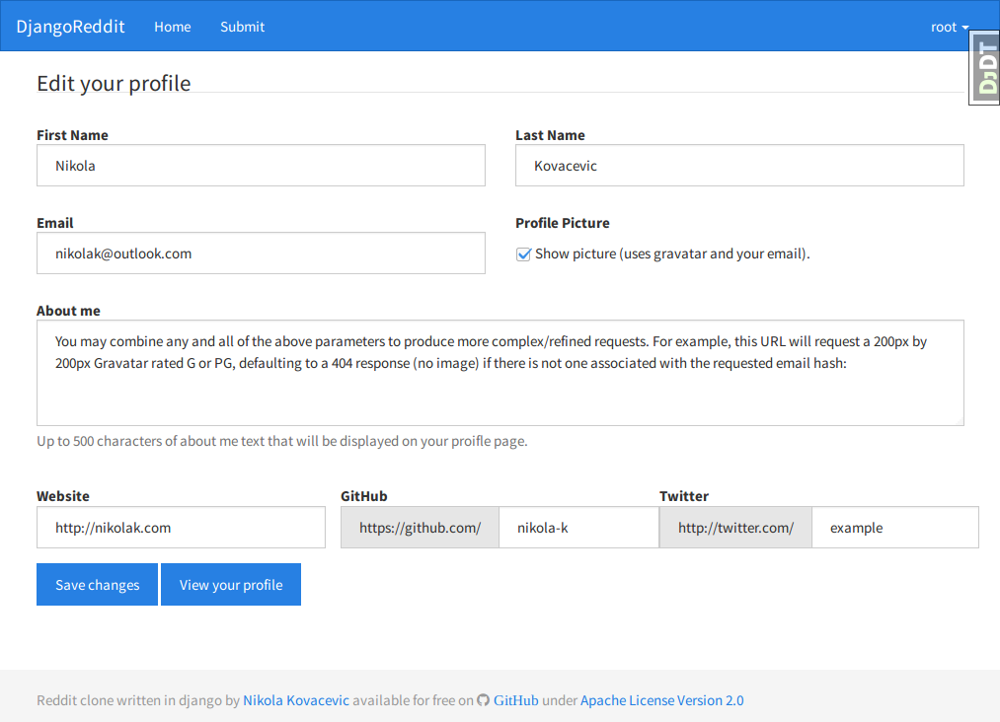

#Django reddit
Reddit clone written in python using django web framework and twitter's bootstrap.

#Screenshots

Fully responsive:

#Getting up and running

The steps below will get you up and running with a local development environment. We assume you have the following installed:

    pip
    virtualenv
    
First make sure to create and activate a virtualenv, then open a terminal at the project root and install the requirements for local development:

    $ pip install -r requirements.txt
    $ python manage.py migrate
    $ python manage.py syncdb
    $ python manage.py runserver
    
For the time being there is no separate production specific settings because the project is not yet production ready.

#Deployment

* TODO: Add Procfile

#License

    Copyright 2014 Nikola Kovacevic <nikolak@outlook.com>

    Licensed under the Apache License, Version 2.0 (the "License");
    you may not use this file except in compliance with the License.
    You may obtain a copy of the License at

        http://www.apache.org/licenses/LICENSE-2.0

    Unless required by applicable law or agreed to in writing, software
    distributed under the License is distributed on an "AS IS" BASIS,
    WITHOUT WARRANTIES OR CONDITIONS OF ANY KIND, either express or implied.
    See the License for the specific language governing permissions and
    limitations under the License.

